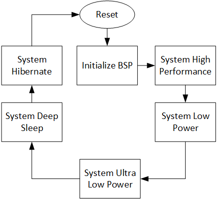

[Click here](../README.md) to view the README.

## Design and implementation

The design of this application is minimalistic to get started with code examples on PSOC&trade; Edge MCU devices. All PSOC&trade; Edge E84 MCU applications have a dual-CPU three-project structure to develop code for the CM33 and CM55 cores. The CM33 core has two separate projects for the secure processing environment (SPE) and non-secure processing environment (NSPE). A project folder consists of various subfolders, each denoting a specific aspect of the project. The three project folders are as follows:

**Table 1. Application projects**

Project | Description
--------|------------------------
*proj_cm33_s* | Project for CM33 secure processing environment (SPE)
*proj_cm33_ns* | Project for CM33 non-secure processing environment (NSPE)
*proj_cm55* | CM55 project

 

In this code example, at device reset, the secure boot process starts from the ROM boot with the secure enclave (SE) as the root of trust (RoT). From the secure enclave, the boot flow is passed on to the system CPU subsystem where the secure CM33 application starts. After all necessary secure configurations, the flow is passed on to the non-secure CM33 application. Resource initialization for this example is performed by this CM33 non-secure project. It configures the system clocks, pins, clock to peripheral connections, and other platform resources. It then enables the CM55 core using the `Cy_SysEnableCM55()` function and the CM55 core is subsequently put to DeepSleep mode.

In the CM33 non-secure application, the clocks and system resources are initialized by the BSP initialization function.

**Table 2** displays the configurations for different system power modes. It includes the SysPm API functions used, VCCD voltage, and CM33 and CM55 clock speeds.

**Table 2. System Power Configurations**

 Power mode                   | SysPm API used                         | VCCD   | CM33 clock | CM55 clock
 :--------------------------- | :-------------------                   | :----  | :--------- | :---------
 System high performace (HP)  | `Cy_SysPm_SystemEnterHp`               | 0.9 V  | 200 MHz    | 400 MHz   
 System Low Power (LP)        | `Cy_SysPm_SystemEnterLp`               | 0.8 V  | 70 MHz     | 140 MHz   
 System ultra Low Power (ULP) | `Cy_SysPm_SystemEnterUlp`              | 0.7 V  | 50 MHz     | 50 MHz    
 System Deep Sleep            | `Cy_SysPm_CpuEnterDeepSleep`           | 0.7 V  | Off        | Off      
 System hibernate             | `Cy_SysPm_SystemEnterHibernate`        | Off    | Off        | Off        

 

To control the power mode of the firmware, simply press the USER BTN1. Each press of this button will cause the firmware to change its power mode as per the following flowchart.

   **Figure 2. Flow diagram for the switching power modes**

   